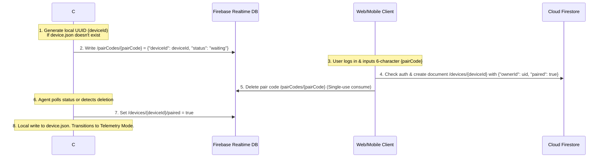
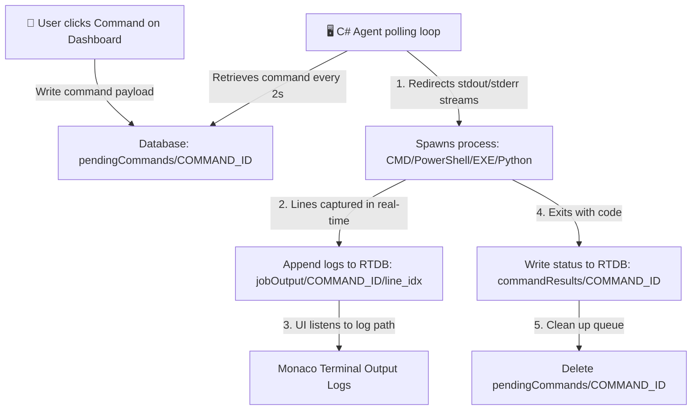

# ClusterOS — Distributed PC Monitoring & Intelligent Workload Manager

<div align="center">

[](https://nextjs.org)
[](https://typescriptlang.org)
[](https://firebase.google.com)
[](https://dotnet.microsoft.com)
[](https://kotlinlang.org)
[](https://developer.android.com/compose)
[](LICENSE)

**Real-time distributed hardware telemetry, remote administrative orchestration, AI-driven workload scheduling, and P2P compute rental hosting.**

[Live Dashboard](https://cluster300809.web.app) · [Setup Guide](#installation--setup) · [Architecture & Workflows](#system-architecture--workflows)

</div>

---

## 📖 Table of Contents
1. [System Overview](#-system-overview)
2. [Key Architecture & Core Workflows](#-key-architecture--core-workflows)
   - [Zero-Configuration Pairing Handshake](#1-zero-configuration-pairing-handshake)
   - [Live Multi-Sensor Telemetry & Process Pipeline](#2-live-multi-sensor-telemetry--process-pipeline)
   - [Remote Command & Execution Pipeline](#3-remote-command--execution-pipeline)
   - [Intelligent AI Workload Studio & Scheduler Engine](#4-intelligent-ai-workload-studio--scheduler-engine)
   - [Compute Rental Engine & Secure Escrow Workflow](#5-compute-rental-engine--secure-escrow-workflow)
   - [Android Mobile Agent Integration](#6-android-mobile-agent-integration)
3. [Folder Structure & Component Mapping](#-folder-structure--component-mapping)
4. [Firestore & Realtime Database Schemas](#-database-schemas)
5. [Installation & Setup](#-installation--setup)
   - [Web Dashboard Setup](#1-web-dashboard-nextjs)
   - [Windows C# Agent Build & Service Installation](#2-windows-c-agents)
   - [Android Kotlin Mobile Client Configuration](#3-android-kotlin-mobile-client)
6. [Security Architecture](#-security-architecture)
7. [Design System & UI Guidelines](#-design-system--ui)

---

## 🖥️ System Overview

ClusterOS is a production-grade distributed infrastructure manager designed to aggregate heterogeneous consumer PCs into a cohesive, rent-ready compute cluster.

| Component | Stack | Purpose | Key Files |
| :--- | :--- | :--- | :--- |
| **Web Dashboard** | Next.js 16 (App Router), TypeScript, Tailwind CSS, Framer Motion, Recharts, Zustand | User console to monitor nodes, run shell/python commands, schedule AI training notebooks, rent resources, and process payments | [`src/app/`](file:///f:/cluster/dashboard/src/app/), [`src/lib/`](file:///f:/cluster/dashboard/src/lib/) |
| **Windows Agent** | C# .NET 9 Background Service / Console App, LibreHardwareMonitor, FirebaseAdmin SDK | Standard node daemon that gathers hardware sensor readings, polls pending commands, downloads Google Drive datasets, auto-installs python libraries, and streams stdout back | [`ClusterOSAgent/`](file:///f:/cluster/agent/ClusterOSAgent/) |
| **Windows Rental Agent** | C# .NET 9 Console App, LibreHardwareMonitor, Firebase REST Integration | Special agent variant for host nodes renting their compute power. It includes a rental heartbeat sync loop and prints local logs | [`ClusterOSRentalAgent/`](file:///f:/cluster/agent/ClusterOSRentalAgent/) |
| **Mobile Agent** | Native Android (Kotlin 2.0, Jetpack Compose, OkHttp REST client) | Light daemon to either pair as a mobile host node, view the general cluster health telemetry, or simulate compute workloads | [`mobile-agent/`](file:///f:/cluster/mobile-agent/) |

---

## ⚙️ Key Architecture & Core Workflows

### 1. Zero-Configuration Pairing Handshake

A secure, passwordless handshake matches new physical nodes to dashboard users.



---

### 2. Live Multi-Sensor Telemetry & Process Pipeline

Every **5 seconds**, C# agents scrape system parameters and push them to the Realtime Database. 

- **Scrapers**: Native Windows Performance Counters + `LibreHardwareMonitorLib` handles CPU Package/Core Temperatures, GPU Usage, and Fan Speeds.
- **Process Aggregator**: The agent retrieves all active processes, compiles CPU% and RamMB, sorts them, and uploads the top 20 resource-heavy entries to `/devices/{deviceId}/processes`.
- **Reactive UI**: Next.js dashboard uses Firebase `onValue` sockets to update metric gauges, graphs, and system charts instantly without HTTP polling.

---

### 3. Remote Command & Execution Pipeline

Users can issue administrative actions directly from the dashboard:



---

### 4. Intelligent AI Workload Studio & Scheduler Engine

The scheduling engine ([scheduler.ts](file:///f:/cluster/dashboard/src/lib/scheduler.ts)) is inspired by Kubernetes and Slurm, utilizing a weighted scoring formula to route jobs to the most suitable node in a cluster.

#### Scoring Formula
$$\text{Score} = 0.30 \cdot \text{CPU} + 0.20 \cdot \text{RAM} + 0.10 \cdot \text{GPU} + 0.10 \cdot \text{Temp} + 0.10 \cdot \text{Network} + 0.10 \cdot \text{Queue} + 0.05 \cdot \text{Reliability} + 0.05 \cdot \text{Disk}$$

#### Core Constraints & Elimination Filter
Before a node is scored, it passes through an **Elimination Filter**. A node is eliminated from scheduling if:
- The node is **offline** or has missed its heartbeat timeout (**45 seconds**).
- CPU temperature $\ge 90^\circ\text{C}$ or GPU temperature $\ge 95^\circ\text{C}$.
- RAM usage $\ge 95\%$ or Disk usage $\ge 95\%$.
- Active waiting queue $\ge 20$ tasks.

#### Colab-Style Training Notebooks
Under the **Notebook Studio**, users run multi-cell python executions with dataset mounting:
1. Upload `.csv` or other datasets to Firebase Storage or link a public/private Google Drive file.
2. The scheduler decides the optimal destination machine.
3. The destination agent downloads the code, resolves missing imports by parsing `import` statements, automatically triggers `pip install`, and streams execution output.

---

### 5. Compute Rental Engine & Secure Escrow Workflow

Hosts can list standard PCs or mobile devices in the shared hosting pool. Renters pay to gain exclusive workspace access.

#### Payment and Session Lifecycle
- **Modes**: 
  - **Fixed Timer**: Renter pre-selects minutes (e.g. 15, 30, 45, 60 min).
  - **Pay-As-You-Go**: Runs indefinitely until stopped.
- **Accrual Logic**: The active session state (`elapsedSeconds`, `earnedBalance`) is calculated and synced back to the database every 2 seconds by the hosting agent.
- **Auto-Checkout Safeguard**: When a fixed session's timer expires, the dashboard's hosting listener triggers `handleCompleteSession` to transfer the earned amount into the host's balance. A security guard ensures only the host's client handles this call to prevent duplicate balance updates from multiple listeners.
- **Host Penalty (Violation)**: If a host agent shuts down, exits prematurely, or disconnects during a running session, the renter can trigger a **Host Violation Termination**, terminating the rental session cleanly and penalizing the host.
- **Host Withdraw Flow**: Service providers request withdrawals using the dashboard's withdraw console. Clicking "Request Withdraw" prompts a modal supporting fractional amount select (25%, 50%, 75%, MAX). Deductions are calculated using floating-point precision and saved in Firestore.

---

### 6. Android Mobile Agent Integration

The Android Mobile Agent ([mobile-agent/](file:///f:/cluster/mobile-agent/)) serves a dual role:
- **Hosting Node**: Allows turning on a **Rental Hosting Console** switch to register the mobile device (`MOB-...` key prefix) as a cluster node, pushing battery levels, CPU usage, RAM usage, and online status to the dashboard via lightweight HTTP REST requests.
- **Python Simulator**: Since Android devices lack a native Python interpreter, the app incorporates a custom **ML Script Simulator** in [`AgentService.kt`](file:///f:/cluster/mobile-agent/app/src/main/java/com/example/clusterosmobileagent/service/AgentService.kt). 
  - It parses script structures and detects data imports (`pandas`, `scikit-learn`, `numpy`, `tensorflow`, `torch`).
  - It simulates data preparation, train/test splitting, ML model training (LogisticRegression, RandomForest, Neural Networks), accuracy calculation, and model prediction output, streaming simulated standard logs to the dashboard console.

---

## 📂 Folder Structure & Component Mapping

```
f:\cluster\
├── dashboard/                      ← Next.js 16 Web Dashboard Application
│   ├── src/
│   │   ├── app/
│   │   │   └── (dashboard)/        ← Dashboard App Router Pages
│   │   │       ├── analytics/      ← Recharts-driven cluster loads & usage metrics
│   │   │       ├── clusters/       ← Logical device grouping (create, rename, add nodes)
│   │   │       ├── commands/       ← Action history tracker & raw cmd terminal
│   │   │       ├── device/         ← Detailed dashboard for individual PC charts
│   │   │       ├── devices/        ← Grid view of standard & rental nodes
│   │   │       ├── jobs/           ← Script dispatch wizard & scheduler config
│   │   │       ├── notebook/       ← Colab-like Python training workspace with datasets
│   │   │       ├── page.tsx        ← Command Center / KPI overview page
│   │   │       ├── rentals/        ← Rental host/renter session manager & payouts
│   │   │       └── settings/       ← Profile configurations & notifications
│   │   ├── components/             ← Shared components (charts, modals, layout)
│   │   ├── hooks/                  ← useAuth for session state
│   │   ├── lib/                    ← db (Firestore), rtdb (Realtime), scheduler (AI engine)
│   │   ├── store/                  ← Zustand global store (appStore.ts)
│   │   └── types/                  ← TypeScript interface schemas (index.ts)
│   ├── public/                     ← Public assets & client downloads
│   └── package.json
│
├── agent/
│   ├── ClusterOSAgent/             ← C# Windows Service Agent
│   │   ├── Hardware/               ← PerformanceCounter & LibreHardwareMonitor wrappers
│   │   ├── Firebase/               ← Firebase SDK client configurations
│   │   ├── Commands/               ← CommandHandler (polling) & CommandExecutor (execution)
│   │   └── Models/                 ← C# Class Schemas matching TypeScript types
│   │
│   ├── ClusterOSRentalAgent/       ← C# Compute Host Rental Agent
│   │   ├── Commands/               ← CommandExecutor with -W ignore Python flags
│   │   └── Models/                 ← Models for rental sessions and metrics
│   │
│   └── installer/                  ← Inno Setup Script (.iss) to compile Windows installers
│
├── mobile-agent/                   ← Native Android Application
│   └── app/src/main/java/com/example/clusterosmobileagent/
│       ├── service/                ← AgentService (REST API heartbeat & ML Python simulator)
│       └── ui/main/                ← MainScreen (Jetpack Compose interface)
│
├── firebase/                       ← Firebase Project Configurations
│   ├── firestore.rules             ← Strict document-level security rules
│   └── database.rules.json         ← RTDB path-level permissions
│
└── README.md                       ← Project guide
```

---

## 🗄️ Database Schemas

### 1. Cloud Firestore

#### `users` Collection
Stores registered dashboard profiles.
```typescript
{
  uid: string;
  email: string;
  role: 'admin' | 'operator' | 'viewer';
  balance: number; // currency for P2P rentals (৳ Tk)
  createdAt: number;
}
```

#### `devices` Collection
Maintains device pairing status and owner linkage.
```typescript
{
  deviceId: string;
  pairCode: string;
  name: string;
  machineName: string;
  ownerId: string;
  clusterId?: string;
  paired: boolean;
  type: 'standard' | 'rental';
  rentalStatus: 'idle' | 'rented';
  rentalSessionId?: string | null;
  createdAt: number;
}
```

#### `withdrawals` Collection
Records payment requests completed by hosts.
```typescript
{
  userId: string;
  email: string;
  amount: number;
  status: 'completed';
  createdAt: number;
}
```

---

### 2. Realtime Database

RTDB acts as the high-frequency message bus between agents and dashboards.

```json
{
  "devices": {
    "DEVICE_ID": {
      "metrics": {
        "timestamp": 1782349000,
        "cpu": { "total": 45.2, "cores": [40, 50, 42, 48], "name": "Intel Core i7-12700H" },
        "ram": { "usedPercent": 62.1, "used": 9.9, "total": 16.0 },
        "gpu": { "usagePercent": 12.0, "memUsedPercent": 35.0, "name": "NVIDIA RTX 3060" },
        "disk": { "usedPercent": 48.0, "readMbps": 1.2, "writeMbps": 0.4 },
        "network": { "uploadMbps": 4.5, "downloadMbps": 45.0, "latencyMs": 12 },
        "temperatures": { "cpu": 65, "gpu": 68 },
        "status": "online",
        "batteryPercent": 85,
        "healthStatus": "healthy"
      },
      "processes": [
        { "pid": 4812, "name": "chrome.exe", "cpuPercent": 12.4, "ramMB": 420, "status": "running" }
      ],
      "pendingCommands": {
        "COMMAND_ID": {
          "type": "run_script",
          "payload": { "script": "import pandas as pd\n..." },
          "issuedAt": 1782349050
        }
      },
      "commandResults": {
        "COMMAND_ID": {
          "status": "success",
          "output": "Accuracy: 1.0\nPrediction: [1]",
          "completedAt": 1782349080
        }
      },
      "activeRentalSession": {
        "sessionId": "SESSION_ID",
        "status": "running",
        "mode": "fixed",
        "hourlyRate": 100,
        "durationMinutes": 30,
        "startTime": 1782349000,
        "elapsedSeconds": 120,
        "earnedBalance": 3.33
      }
    }
  },
  "pairCodes": {
    "XK7M9P": {
      "deviceId": "PC-A1B2C3",
      "machineName": "DESKTOP-WORKSTATION",
      "status": "waiting"
    }
  }
}
```

---

## 🚀 Installation & Setup

### 1. Web Dashboard (Next.js)

#### Prerequisites
- **Node.js** v18+ and **npm** v10+

#### Setup Instructions
1. Navigate to the dashboard directory:
   ```bash
   cd dashboard
   ```
2. Install dependencies:
   ```bash
   npm install
   ```
3. Create a `.env.local` file in `dashboard/` with your Firebase environment parameters:
   ```env
   NEXT_PUBLIC_FIREBASE_API_KEY="your-api-key"
   NEXT_PUBLIC_FIREBASE_AUTH_DOMAIN="your-auth-domain"
   NEXT_PUBLIC_FIREBASE_PROJECT_ID="cluster300809"
   NEXT_PUBLIC_FIREBASE_STORAGE_BUCKET="cluster300809.appspot.com"
   NEXT_PUBLIC_FIREBASE_MESSAGING_SENDER_ID="your-sender-id"
   NEXT_PUBLIC_FIREBASE_APP_ID="your-app-id"
   NEXT_PUBLIC_FIREBASE_DATABASE_URL="https://cluster300809-default-rtdb.firebaseio.com"
   ```
4. Spin up the local development web server:
   ```bash
   npm run dev
   ```
5. Open your browser and navigate to `http://localhost:3000`.

---

### 2. Windows C# Agents

The agent can be built and run either as a manual console application or installed as a persistent Windows Service.

#### Prerequisites
- **.NET 9.0 SDK** or later
- Windows 10/11 64-bit

#### Build Standard Agent
```powershell
cd agent\ClusterOSAgent
dotnet restore
dotnet publish -c Release -r win-x64 --self-contained true -p:PublishSingleFile=true -o ../../dist/agent
```

#### Build Rental Agent
```powershell
cd agent\ClusterOSRentalAgent
dotnet restore
dotnet publish -c Release -r win-x64 --self-contained true -p:PublishSingleFile=true -o ../../dist/rental-agent
```

#### Running and Configuration
On first launch, the agent creates a `device.json` file in its current directory:
```json
{
  "DeviceId": "PC-RNT-A1B2C3",
  "PairCode": "XK7M9P",
  "MachineName": "DESKTOP-HOST",
  "IsPaired": false,
  "IsRegistered": true
}
```
Ensure you provide a valid `appsettings.json` file with your Firebase Database URL, API Key, and Project ID before launching.

---

### 3. Android Kotlin Mobile Client

#### Build Requirements
- **Android Studio Ladybug** or later
- **JDK 17**
- **Android SDK 34** (API 34)

#### Compilation Steps
1. Open the `/mobile-agent` directory in Android Studio.
2. Ensure internet access is enabled so Gradle can sync and pull dependencies (such as Jetpack Compose, OkHttp, and Google Play Services).
3. Connect an Android phone with USB Debugging enabled, or boot up an AVD emulator.
4. Click **Run** or use the Gradle task:
   ```bash
   ./gradlew assembleDebug
   ```
5. The generated APK will be located at `app/build/outputs/apk/debug/app-debug.apk`.

---

## 🔒 Security Architecture

ClusterOS secures compute resources and user data through multi-layered safeguards:

- **Firebase Authentication**: Ensures only authorized users access dashboard pages and device terminals.
- **Granular Security Rules**:
  - **Firestore Rules**: Restricts document reads and writes. Users can only fetch and update devices and clusters linked to their unique `ownerId`.
  - **RTDB Rules**: Enforces that only paired agents and authenticated owners can read or write metrics and command objects under their respective `/devices/{deviceId}` paths.
- **Pair Code Self-Destruction**: Pairing codes are deleted from `/pairCodes/{code}` instantly once consumed, preventing session hijacking or replay attacks.
- **Command Scoping**: Power state functions and processes are restricted to the validated owner of that machine, preventing unauthorized execution.

---

## 🎨 Design System & UI

- **Color Theme**: Deep OLED Space Dark (`#020617` background with `#0f172a` cards).
- **Core Accents**: Radiant Emerald Green (`#22c55e`) for online/active metrics, Amber (`#f59e0b`) for active rental timers, and Crimson (`#ef4444`) for critical heat alerts.
- **Typography**: Plus Jakarta Sans / Inter for clear metric scanning, and Fira Code / JetBrains Mono for system log terminals.
- **Libraries**:
  - **Recharts**: Responsive area and radial charts depicting real-time historical usage.
  - **Framer Motion**: Smooth entry layouts (150ms transitions) and micro-interactions on hover.
  - **Lucide Icons**: Consistent, light icon set matching all hardware sensors and actions.
