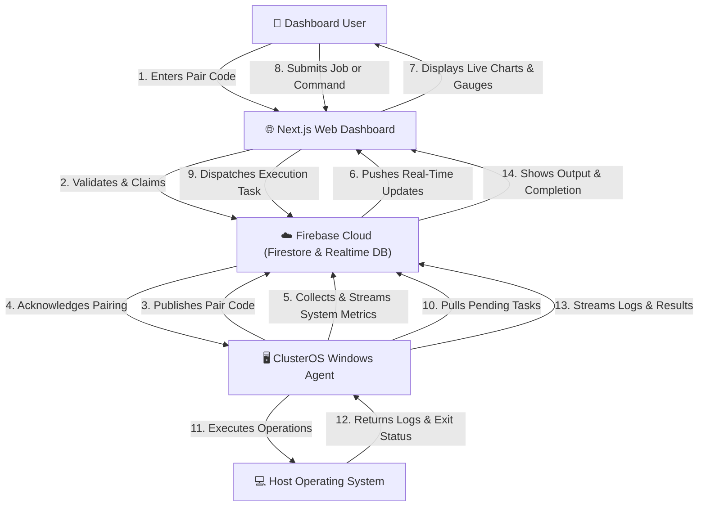

# ClusterOS — Distributed PC Monitoring & Intelligent Workload Manager

<div align="center">

[](https://nextjs.org)
[](https://typescriptlang.org)
[](https://firebase.google.com)
[](https://dotnet.microsoft.com)
[](LICENSE)

**Real-time distributed PC monitoring, remote control, and intelligent workload orchestration**

[Live Dashboard](https://cluster300809.web.app) · [Add Device](#device-pairing) · [Documentation](#documentation)

</div>

---

## Overview

ClusterOS is a production-grade distributed monitoring system consisting of three key components working in unison:

| Component | Technology | Purpose |
|-----------|-----------|---------|
| **Web Dashboard** | Next.js 16 + Firebase | Monitor, dispatch workloads, configure and manage all cluster nodes |
| **Windows Agent** | C#/.NET 9 | Run as Windows service/Forms app, collect system metrics, execute jobs/commands |
| **Mobile Agent** | Android (Kotlin + Compose) | Monitor node metrics and check cluster status on the go |

---

## Downloads

Download the pre-compiled clients directly to get started:

- 💾 **[ClusterOS Agent (Standard) (.exe)](https://github.com/rahat300809/cluster_sheduling_AI/releases/download/v1.0.0/ClusterOSAgent.exe)** — The main Windows client for background monitoring and task execution.
- 💾 **[ClusterOS Rental Agent (.exe)](https://github.com/rahat300809/cluster_sheduling_AI/releases/download/v1.0.0/ClusterOSRentalAgent.exe)** — Special Windows client variant tailored for compute rental monitoring.
- 📱 **[ClusterOS Mobile Client (.apk)](https://github.com/rahat300809/cluster_sheduling_AI/releases/download/v1.0.0/ClusterOSMobileAgent.apk)** — Android application for real-time mobile monitoring.

---

## Features

### 🖥️ Real-Time Monitoring
- CPU usage per core + overall load
- RAM usage, available memory  
- GPU usage + VRAM utilization
- Disk usage and throughput
- Network upload/download speeds
- CPU and GPU temperatures
- All metrics update every **5 seconds**

### 🔧 Remote Control
- **Shutdown, Restart, Sleep, Lock** — one click
- **Kill Process** — terminate any running process
- **Run CMD Command** — execute arbitrary shell commands
- **Run Python Script** — dispatch Python code remotely
- **Run EXE** — launch executables with output capture

### 📊 Dashboard Pages
1. **Command Center** — Overview with cluster KPIs, load intelligence
2. **Devices** — All PCs with live metrics, online/offline status
3. **Device Detail** — Real-time charts, process list, quick commands
4. **Processes** — Cross-device process table with kill action
5. **Commands** — Issue & track remote commands with history
6. **Clusters** — Logical device groups with aggregate stats
7. **Jobs** — Queue Python/batch/EXE jobs to devices or clusters
8. **Analytics** — Load comparison, job stats, temperature charts
9. **Settings** — Profile, security, notification preferences

### 🧠 Intelligent Load Manager
- Detects when CPU > 85% or RAM > 90%
- Recommends routing jobs to the lowest-loaded node
- Visual alerts on the dashboard

---

## System Architecture & Workflow Proposal

### High-Level System Overview



### End-to-End System Work Process

The ClusterOS platform consists of several asynchronous workflows connecting the Web Dashboard, Windows C# Agents, Firebase Realtime Database, Firestore, and the Android Mobile Client. Below is the detailed step-by-step description of the system's operational work processes:

#### 1. Zero-Configuration Handshake & Secure Device Pairing
To register and link a new machine to a user account securely without manual credential entry:
1. **Hardware Footprint Generation**: Upon starting, the Windows Agent checks for a local `device.json` file. If none is found, it queries the hardware details (CPU UUID, Motherboard Serial, MAC address) to generate a unique persistent `deviceId`.
2. **Pairing Code Creation**: The agent generates a random 6-character single-use alphanumeric pair code (e.g., `XK7M9P`) and uploads it to Firebase RTDB under `/pairCodes/{code}` with a state of `{"deviceId": "PC-...", "status": "waiting"}`.
3. **Dashboard/Mobile Claiming**: The authenticated user signs in to the Next.js Dashboard or Android Mobile App, goes to the "Add Device" view, and enters the pairing code.
4. **Firestore Handshake & Database Cleanup**: Firestore security rules validate that the user is authenticated. It claims the device by updating `/devices/{deviceId}` in Firestore with `ownerId = {uid}` and `paired = true`. The system then deletes the temporary pair code from `/pairCodes/{code}` to prevent reuse.
5. **Agent State Upgrade**: The C# Agent, which listens to changes on its own status, detects the pairing completion. It writes the configuration locally to `device.json` and upgrades its execution state from Pairing Mode to Telemetry Mode.

#### 2. Live Multi-Sensor Telemetry & Process Pipeline
Telemetry runs continuously to feed real-time resource data to the user interfaces with minimal latency:
1. **Hardware Metrics Scraped**: Every 5 seconds, the Windows Agent uses native APIs and `LibreHardwareMonitorLib` to query sensor data:
   - **CPU**: Core-by-core load, aggregate load, and package temperature.
   - **Memory**: Total, used, and free RAM.
   - **GPU**: Core utilization, VRAM usage, and GPU temperature.
   - **Disk**: IO throughput and partition space usage.
   - **Network**: Real-time upload and download speeds.
2. **Top Processes Tracked**: The agent queries active operating system processes, retrieves their memory and CPU utilization, and sorts them to find the top 20 resource-heavy processes.
3. **Realtime Database Synchronization**: The collected metrics and process lists are serialized to JSON and pushed directly to Firebase RTDB under `/devices/{deviceId}/metrics` and `/devices/{deviceId}/processes`.
4. **Reactive UI Binding**: The Next.js dashboard and Android Mobile App maintain active WebSocket-like listeners on the database paths. The moment the database updates, the UI instantly updates its charts, metric gauges, and process tables without polling.

#### 3. Remote Operations & Command Pipeline
Administrative operations are routed and executed asynchronously with real-time feedback:
1. **Action Triggered**: The user clicks a power command (Shutdown, Restart, Sleep, Lock), terminates a process, or inputs a shell command/script on the dashboard or mobile app.
2. **Task Queueing**: The command details (command type, script payload, timestamp) are written to `/devices/{deviceId}/pendingCommands/{commandId}` in the Realtime Database.
3. **Agent Polling & Interception**: The Windows Agent runs a background polling handler that checks the database queue every 2 seconds.
4. **Command Execution**: Upon pulling a command, the Agent spawns a child process using `System.Diagnostics.Process` with administrative privileges. It redirects the standard output (`stdout`) and standard error (`stderr`) streams.
5. **Console Log Streaming**: As the child process runs, the C# Agent captures output streams line-by-line and streams them immediately back to the `/devices/{deviceId}/commandResults/{commandId}` database endpoint.
6. **Cleanup**: Once execution completes, the final exit code is uploaded, the temporary pending command is deleted, and the UI displays the successful completion log.

#### 4. Intelligent AI Workload Studio & Least-Loaded Scheduling
When executing complex python or automated batch jobs across a cluster of PCs:
1. **Job Composition**: Users draft Python scripts or automation routines inside the Monaco Code Editor on the dashboard, complete with syntax highlighting and editor configurations.
2. **Resource Load Evaluation**: When the user clicks "Run Job", the scheduler queries the live telemetry metrics of all active and online nodes in the target cluster.
3. **Intelligent Load Balancing**: The system evaluates each node's load using a weighted formula combining CPU usage (weight 40%), RAM usage (weight 30%), GPU usage (weight 20%), and Temperature state (weight 10%). The node with the lowest calculated load is automatically designated as the target.
4. **Job Dispatch**: The script is compiled and pushed as an execution task to the selected node's queue.
5. **Dynamic Dependency Setup**: The C# Agent on the target machine receives the script, automatically detects missing python package dependencies, runs `pip install` in a subprocess, streams the installer progress live to the user, and then runs the python script.

#### 5. Native Android Mobile Client Workflow
The Android app enables convenient monitoring of the cluster from mobile devices:
1. **User Authentication**: Integrates with Firebase Auth, logging in users using email/password.
2. **Device Discovery**: The app queries Firestore for all device documents owned by the logged-in user.
3. **Active Telemetry Binding**: Using the Firebase Android Kotlin SDK, the app binds directly to RTDB endpoints for each device, allowing live updates of system health graphs, charts, and process lists designed in a mobile-optimized layout using Jetpack Compose.

---

## Quick Start

### Dashboard

The dashboard is already deployed at: **https://cluster300809.web.app**

To run locally:

```bash
cd dashboard
npm install
npm run dev
# Open http://localhost:3000
```

### Windows Agent

#### Prerequisites
- [.NET 9 SDK](https://dotnet.microsoft.com/download/dotnet/9.0)
- Windows 10/11 64-bit
- Administrator privileges (for hardware monitoring)

#### Build from Source

```powershell
cd agent\ClusterOSAgent
dotnet restore
dotnet publish -c Release -r win-x64 --self-contained true -p:PublishSingleFile=true -o ../../dist/agent
```

#### Install as Windows Service

```powershell
# Copy the published binary to install directory
Copy-Item ../../dist/agent/ClusterOSAgent.exe "C:\Program Files\ClusterOS\"
Copy-Item appsettings.json "C:\Program Files\ClusterOS\"

# Install as service
sc create "ClusterOS Agent" binPath= "C:\Program Files\ClusterOS\ClusterOSAgent.exe" start= auto
sc description "ClusterOS Agent" "Distributed PC monitoring agent"
sc start "ClusterOS Agent"
```

#### Or Use the Installer
Build and run `agent/installer/ClusterOSAgent.iss` with [Inno Setup 6](https://jrsoftware.org/isdl.php).

---

## Device Pairing

1. **Start the agent** on the Windows PC you want to monitor
2. On first launch, the agent prints:
   ```
   ═══════════════════════════════════════
       ClusterOS Agent - First Launch      
   ═══════════════════════════════════════
     Device ID:  PC-A1B2C3
     Pair Code:  XK7M9P
   ═══════════════════════════════════════
   ```
3. **Open the Dashboard** → Devices → **Add Device**
4. **Enter the Pair Code** — device is now linked to your account
5. Metrics start flowing within 5 seconds ✅

---

## Firebase Setup

The project uses Firebase project `cluster300809`.

### Deploy Firestore Rules
```bash
firebase deploy --only firestore:rules
```

### Deploy RTDB Rules
```bash
firebase deploy --only database
```

### Deploy Dashboard
```bash
cd dashboard
npm run build
firebase deploy --only hosting
```

---

## Folder Structure

```
f:\cluster\
├── dashboard/               ← Next.js 15 web app
│   ├── src/
│   │   ├── app/             ← App Router pages (10 pages)
│   │   ├── components/      ← UI components
│   │   │   ├── layout/      ← Sidebar, TopBar
│   │   │   └── charts/      ← MetricGauge, MiniSparkline
│   │   ├── lib/             ← Firebase, Firestore, RTDB helpers
│   │   ├── hooks/           ← AuthProvider, useAuth
│   │   ├── store/           ← Zustand global state
│   │   └── types/           ← TypeScript interfaces
│   └── package.json
│
├── agent/
│   ├── ClusterOSAgent/      ← C# Windows Agent
│   │   ├── Program.cs
│   │   ├── AgentService.cs
│   │   ├── Hardware/        ← HardwareMonitor, ProcessMonitor
│   │   ├── Firebase/        ← FirebaseClient, RealtimeDbClient
│   │   ├── Commands/        ← CommandHandler, CommandExecutor
│   │   ├── Models/          ← All data models
│   │   └── appsettings.json
│   └── installer/
│       └── ClusterOSAgent.iss  ← Inno Setup installer
│
├── firebase/
│   ├── firestore.rules      ← Firestore security rules
│   └── database.rules.json  ← RTDB security rules
│
└── README.md
```

---

## Firestore Schema

| Collection | Document | Key Fields |
|------------|----------|------------|
| `users` | `{uid}` | email, role, createdAt |
| `devices` | `{deviceId}` | deviceId, pairCode, ownerId, paired |
| `clusters` | `{clusterId}` | name, deviceIds[], ownerId, color |
| `jobs` | `{jobId}` | name, type, script, status, targetDeviceIds |
| `commands` | `{commandId}` | type, payload, status, issuedBy, output |

## Realtime Database Schema

```
/devices/{deviceId}/
  metrics/          ← SystemSnapshot (every 5s)
  processes/        ← Top 20 processes
  pendingCommands/  ← Commands awaiting execution
  commandResults/   ← Completed command outputs
/pairCodes/{code}/  ← Single-use device pairing codes
```

---

## Security

- ✅ Firebase Authentication required for all dashboard access
- ✅ Firestore rules: users can only access their own devices
- ✅ RTDB rules: authenticated write access
- ✅ Pair codes are **single-use** — deleted after pairing
- ✅ Protected routes via `AuthProvider`
- ✅ Commands are scoped to device owner

---

## Design System

- **Style**: OLED Dark Mode (Deep black `#020617`)
- **Accent**: Green `#22c55e` for active/healthy states
- **Font**: Plus Jakarta Sans
- **Effects**: Glassmorphism cards with `backdrop-blur`
- **Charts**: Recharts (area, bar, radial gauge)
- **Icons**: Lucide React
- **Animation**: Framer Motion (150–300ms transitions)

---

## Tech Stack

| Layer | Technology |
|-------|-----------|
| Frontend | Next.js 16, TypeScript, Tailwind CSS |
| UI Components | Radix UI primitives, Lucide icons |
| Animation | Framer Motion |
| Charts | Recharts |
| State | Zustand |
| Auth | Firebase Authentication |
| Database | Cloud Firestore + Realtime Database |
| Hosting | Firebase Hosting |
| Agent | C# .NET 9, Windows Service |
| Hardware | LibreHardwareMonitor |
| Installer | Inno Setup 6 |

---

## License

MIT © ClusterOS
