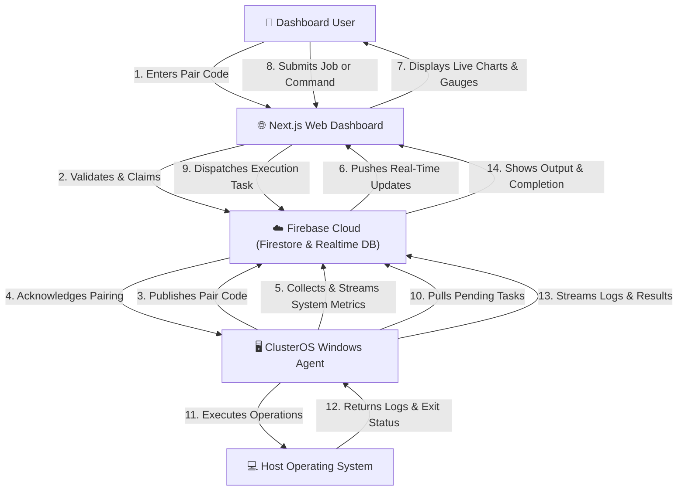

# ClusterOS — Distributed PC Monitoring & Intelligent Workload Manager

<div align="center">

[](https://nextjs.org)
[](https://typescriptlang.org)
[](https://firebase.google.com)
[](https://dotnet.microsoft.com)
[](LICENSE)

**Real-time distributed PC monitoring, remote control, and intelligent workload orchestration**

[Live Dashboard](https://cluster300809.web.app) · [Add Device](#device-pairing) · [Documentation](#documentation)

</div>

---

## Overview

ClusterOS is a production-grade distributed monitoring system with two components:

| Component | Technology | Purpose |
|-----------|-----------|---------|
| **Web Dashboard** | Next.js 15 + Firebase | Monitor, command, and manage all PCs |
| **Windows Agent** | C#/.NET 9 | Collect metrics, execute remote commands |

---

## Features

### 🖥️ Real-Time Monitoring
- CPU usage per core + overall load
- RAM usage, available memory  
- GPU usage + VRAM utilization
- Disk usage and throughput
- Network upload/download speeds
- CPU and GPU temperatures
- All metrics update every **5 seconds**

### 🔧 Remote Control
- **Shutdown, Restart, Sleep, Lock** — one click
- **Kill Process** — terminate any running process
- **Run CMD Command** — execute arbitrary shell commands
- **Run Python Script** — dispatch Python code remotely
- **Run EXE** — launch executables with output capture

### 📊 Dashboard Pages
1. **Command Center** — Overview with cluster KPIs, load intelligence
2. **Devices** — All PCs with live metrics, online/offline status
3. **Device Detail** — Real-time charts, process list, quick commands
4. **Processes** — Cross-device process table with kill action
5. **Commands** — Issue & track remote commands with history
6. **Clusters** — Logical device groups with aggregate stats
7. **Jobs** — Queue Python/batch/EXE jobs to devices or clusters
8. **Analytics** — Load comparison, job stats, temperature charts
9. **Settings** — Profile, security, notification preferences

### 🧠 Intelligent Load Manager
- Detects when CPU > 85% or RAM > 90%
- Recommends routing jobs to the lowest-loaded node
- Visual alerts on the dashboard

---

## System Architecture & Workflow Proposal

### High-Level System Overview



### End-to-End System Workflow

This proposal details the core workflows linking the Web Dashboard, Firebase, and Windows Agent. Each sequence functions autonomously to ensure zero-configuration setup, real-time telemetry, and secure command execution.

#### 1. Device Handshake & Pairing Workflow
The pairing flow establishes a secure link between a new physical machine and a user account without manual credential sharing:
1. **Agent Setup**: Upon starting, the Windows Agent generates a unique, persistent hardware footprint and a random 6-character single-use pairing code. It uploads this pairing code to the Realtime Database with a status of `waiting`.
2. **Dashboard Pairing**: The authenticated user opens the dashboard, enters the pairing code, and submits.
3. **Database Handshake**: The database validates the pairing code, claims it, and associates the device with the user's account in Firestore. The single-use pairing code is immediately deleted.
4. **Agent Activation**: The agent detects the code consumption, saves the user configuration locally, and transitions from pairing mode to telemetry mode.

#### 2. Real-Time Telemetry & Process Pipeline
Telemetry flows continuously to provide live monitoring with low latency and minimal system overhead:
1. **Metrics Collection**: The Windows Agent queries system sensors (CPU, RAM, GPU, Disk, Network) and live process utilization metrics.
2. **Database Streaming**: Metrics are streamed to the Realtime Database every 5 seconds.
3. **Real-time UI Sync**: Next.js dashboard instances subscribed to the Realtime Database endpoints receive instantaneous UI data-binding updates, showing live graphs, heatmaps, and running process tables.

#### 3. Remote Operations & Command Pipeline
Command routing allows responsive execution of administrative tasks (e.g., shutdown, process killing, run scripts) on remote devices:
1. **Command Issuance**: The user triggers an action or writes a script on the dashboard.
2. **Job Queueing**: The dashboard registers the command in Firestore (for historical logging) and pushes a lightweight task request to the Realtime Database.
3. **Agent Polling & Execution**: The Windows Agent polls the command queue every 2 seconds. When it reads a command payload, it launches the targeted action locally, redirecting system outputs (stdout/stderr) as needed.
4. **Result Reporting**: The Agent streams output streams and final exit codes back to the Realtime Database, which propagates instantly to the dashboard terminal/console.

#### 4. Intelligent Workload & Job Scheduling (Cluster Dispatcher)
When deploying automation scripts to groups of machines:
1. **Script Composition**: The user edits scripts in the Monaco-powered IDE on the dashboard.
2. **Resource Load Assessment**: The scheduler queries live metrics (CPU/RAM/GPU) from all active nodes in the target cluster.
3. **Least-Loaded Routing**: An intelligent load-balancing algorithm automatically assigns the execution task to the node currently reporting the lowest resource usage.
4. **Deployment & Tracking**: The job is dispatched, and progress alerts are streamed to the cluster analytics interface.

---

## Quick Start

### Dashboard

The dashboard is already deployed at: **https://cluster300809.web.app**

To run locally:

```bash
cd dashboard
npm install
npm run dev
# Open http://localhost:3000
```

### Windows Agent

#### Prerequisites
- [.NET 9 SDK](https://dotnet.microsoft.com/download/dotnet/9.0)
- Windows 10/11 64-bit
- Administrator privileges (for hardware monitoring)

#### Build from Source

```powershell
cd agent\ClusterOSAgent
dotnet restore
dotnet publish -c Release -r win-x64 --self-contained true -p:PublishSingleFile=true -o ../../dist/agent
```

#### Install as Windows Service

```powershell
# Copy the published binary to install directory
Copy-Item ../../dist/agent/ClusterOSAgent.exe "C:\Program Files\ClusterOS\"
Copy-Item appsettings.json "C:\Program Files\ClusterOS\"

# Install as service
sc create "ClusterOS Agent" binPath= "C:\Program Files\ClusterOS\ClusterOSAgent.exe" start= auto
sc description "ClusterOS Agent" "Distributed PC monitoring agent"
sc start "ClusterOS Agent"
```

#### Or Use the Installer
Build and run `agent/installer/ClusterOSAgent.iss` with [Inno Setup 6](https://jrsoftware.org/isdl.php).

---

## Device Pairing

1. **Start the agent** on the Windows PC you want to monitor
2. On first launch, the agent prints:
   ```
   ═══════════════════════════════════════
       ClusterOS Agent - First Launch      
   ═══════════════════════════════════════
     Device ID:  PC-A1B2C3
     Pair Code:  XK7M9P
   ═══════════════════════════════════════
   ```
3. **Open the Dashboard** → Devices → **Add Device**
4. **Enter the Pair Code** — device is now linked to your account
5. Metrics start flowing within 5 seconds ✅

---

## Firebase Setup

The project uses Firebase project `cluster300809`.

### Deploy Firestore Rules
```bash
firebase deploy --only firestore:rules
```

### Deploy RTDB Rules
```bash
firebase deploy --only database
```

### Deploy Dashboard
```bash
cd dashboard
npm run build
firebase deploy --only hosting
```

---

## Folder Structure

```
f:\cluster\
├── dashboard/               ← Next.js 15 web app
│   ├── src/
│   │   ├── app/             ← App Router pages (10 pages)
│   │   ├── components/      ← UI components
│   │   │   ├── layout/      ← Sidebar, TopBar
│   │   │   └── charts/      ← MetricGauge, MiniSparkline
│   │   ├── lib/             ← Firebase, Firestore, RTDB helpers
│   │   ├── hooks/           ← AuthProvider, useAuth
│   │   ├── store/           ← Zustand global state
│   │   └── types/           ← TypeScript interfaces
│   └── package.json
│
├── agent/
│   ├── ClusterOSAgent/      ← C# Windows Agent
│   │   ├── Program.cs
│   │   ├── AgentService.cs
│   │   ├── Hardware/        ← HardwareMonitor, ProcessMonitor
│   │   ├── Firebase/        ← FirebaseClient, RealtimeDbClient
│   │   ├── Commands/        ← CommandHandler, CommandExecutor
│   │   ├── Models/          ← All data models
│   │   └── appsettings.json
│   └── installer/
│       └── ClusterOSAgent.iss  ← Inno Setup installer
│
├── firebase/
│   ├── firestore.rules      ← Firestore security rules
│   └── database.rules.json  ← RTDB security rules
│
└── README.md
```

---

## Firestore Schema

| Collection | Document | Key Fields |
|------------|----------|------------|
| `users` | `{uid}` | email, role, createdAt |
| `devices` | `{deviceId}` | deviceId, pairCode, ownerId, paired |
| `clusters` | `{clusterId}` | name, deviceIds[], ownerId, color |
| `jobs` | `{jobId}` | name, type, script, status, targetDeviceIds |
| `commands` | `{commandId}` | type, payload, status, issuedBy, output |

## Realtime Database Schema

```
/devices/{deviceId}/
  metrics/          ← SystemSnapshot (every 5s)
  processes/        ← Top 20 processes
  pendingCommands/  ← Commands awaiting execution
  commandResults/   ← Completed command outputs
/pairCodes/{code}/  ← Single-use device pairing codes
```

---

## Security

- ✅ Firebase Authentication required for all dashboard access
- ✅ Firestore rules: users can only access their own devices
- ✅ RTDB rules: authenticated write access
- ✅ Pair codes are **single-use** — deleted after pairing
- ✅ Protected routes via `AuthProvider`
- ✅ Commands are scoped to device owner

---

## Design System

- **Style**: OLED Dark Mode (Deep black `#020617`)
- **Accent**: Green `#22c55e` for active/healthy states
- **Font**: Plus Jakarta Sans
- **Effects**: Glassmorphism cards with `backdrop-blur`
- **Charts**: Recharts (area, bar, radial gauge)
- **Icons**: Lucide React
- **Animation**: Framer Motion (150–300ms transitions)

---

## Tech Stack

| Layer | Technology |
|-------|-----------|
| Frontend | Next.js 16, TypeScript, Tailwind CSS |
| UI Components | Radix UI primitives, Lucide icons |
| Animation | Framer Motion |
| Charts | Recharts |
| State | Zustand |
| Auth | Firebase Authentication |
| Database | Cloud Firestore + Realtime Database |
| Hosting | Firebase Hosting |
| Agent | C# .NET 9, Windows Service |
| Hardware | LibreHardwareMonitor |
| Installer | Inno Setup 6 |

---

## License

MIT © ClusterOS
